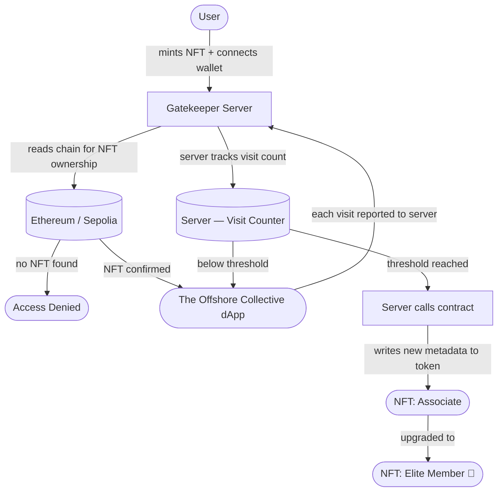

<!-- Banner SVG — option B split rule -->
<svg width="800" height="200" viewBox="0 0 800 200" xmlns="http://www.w3.org/2000/svg">
  <rect width="800" height="200" fill="#0a0f1a" rx="8"/>
  <line x1="0" y1="100" x2="800" y2="100" stroke="#1a2a3a" stroke-width="1"/>
  <text x="400" y="82" font-family="monospace" font-size="44" font-weight="bold" fill="#ffffff" text-anchor="middle" letter-spacing="8">LWAZI MASHIYA</text>
  <line x1="260" y1="110" x2="540" y2="110" stroke="#3d9be9" stroke-width="1"/>
  <text x="400" y="134" font-family="monospace" font-size="13" fill="#85B7EB" text-anchor="middle" letter-spacing="4">FULL-STACK  ·  WEB3  ·  AI AUTOMATION</text>
  <text x="400" y="162" font-family="monospace" font-size="11" fill="#2a4a6a" text-anchor="middle" letter-spacing="2">JOHANNESBURG, ZA</text>
</svg>

---

## About me

CS student at Tshwane University of Technology, Co-Founder of IBM Z TUT Chapter, and Blockchain Developer at Africa's Blockchain Club. I'm a Full-Stack Web2 & Web3 Engineer with a particular interest in **backend servers and social messaging platforms** — building the systems that sit behind the interface: APIs, automation pipelines, bot infrastructure, and server-controlled smart contract backends.

My Web3 work centres on dynamic NFT systems where the server owns the logic — verifying wallet ownership, tracking on-chain activity, and deciding when to push metadata updates to the contract. No static tokens. Everything evolves.

---

## Current flow

<table>
<tr>
<td valign="top" width="33%">

### 🖥️ Backend & Servers
- REST API design & architecture
- Server-side automation pipelines
- n8n workflow orchestration
- Local LLM server deployment (Qwen)
- PL/SQL enterprise data systems
- Java web application backends

**Stack**

</td>
<td valign="top" width="33%">

### 💬 Social Messaging Platforms
- WhatsApp AI client support agent (Qwen)
- Telegram BTC price alert automation
- Bot infrastructure & webhook handlers
- Conversational AI flows
- Real-time data delivery to end users

**Stack**

</td>
<td valign="top" width="33%">

### ⛓️ Web3 & Smart Contracts
- NFT-gated dashboards & access control
- Dynamic & Soulbound Tokens (SBT)
- P2P marketplace infrastructure
- On-chain lottery & prize logic
- Smart contract security auditing

**Stack**

</td>
</tr>
</table>

---

## Frontend

---

## Dynamic NFT — The Offshore Collective

> User connects wallet → server verifies NFT ownership and grants access → server tracks visits → once the threshold is crossed, the server pushes a metadata update directly to the contract, upgrading the token from **Associate** → **Elite Member**.

The server controls the full lifecycle — it gates access by reading the chain, tracks activity in its own state, and when the threshold is hit it calls the smart contract to update the token metadata. The NFT reflects what the server decides, not what's hardcoded on-chain.

---

## Pinned projects

| Project | Type | What it does | Stack |
|---|---|---|---|
| [🤖 WhatsApp AI Agent](https://github.com/MashiyaL/whatsapp-bot) | Messaging Platform | Qwen LLM on a local Node.js server handles client support queries over WhatsApp — no human in the loop. | `Node.js` `Qwen` `AI` |
| [📡 Telegram BTC Bot](https://github.com/MashiyaL) | Messaging Automation | n8n pipeline fetches live BTC prices on a schedule and pushes alerts to clients via Telegram. | `n8n` `Telegram` |
| [⚓ The Offshore Collective](https://github.com/MashiyaL/Dynamic-NFT) | NFT-Gated dApp | Mint → access granted. dApp tracks visits on-chain. Hit the threshold → NFT upgrades from Associate to Elite Member. | `TypeScript` `Solidity` `SBT` |
| [💸 SendiMali](https://github.com/MashiyaL/SendiMali) | P2P Marketplace | Decentralised peer-to-peer value exchange — wallet-based identity, no intermediary. | `Web3` `FinTech` |
| [🚗 Speed Gate](https://github.com/MashiyaL/speed-gate) | NFT Access Control | Each car has its own gated page — to access the Porsche page you need a Porsche NFT, Ferrari requires a Ferrari NFT, and so on. Server verifies the specific token before granting entry. | `Next.js` `Sepolia` |
| [🎰 Powerball](https://github.com/MashiyaL/Powerball) | On-chain Lottery | Server handles GraphQL queries via The Graph Protocol for on-chain data, and integrates Chainlink VRF for verifiable randomness — provably fair prize distribution. | `TypeScript` `Solidity` `Chainlink VRF` `The Graph` |

---

## Credentials & affiliations

| | |
|---|---|
| 🎓 | Computer Science Student — Tshwane University of Technology (2022–Present) |
| 🏛️ | Co-Founder — IBM Z TUT Chapter |
| ⛓️ | Blockchain Developer — Africa's Blockchain Club |
| 🧑‍💼 | IBM Z Student Ambassador Alumni |
| 📜 | Scrum Master Certified (SMC) — Scrum Alliance |
| 📜 | Blockchain Technologies — Interskill Learning |

---

## GitHub stats

---

## Contribution snake

<picture>
  <source media="(prefers-color-scheme: dark)" srcset="https://raw.githubusercontent.com/MashiyaL/MashiyaL/output/github-contribution-grid-snake-dark.svg" />
  <source media="(prefers-color-scheme: light)" srcset="https://raw.githubusercontent.com/MashiyaL/MashiyaL/output/github-contribution-grid-snake.svg" />
  
</picture>

---

Built from Johannesburg · Open to opportunities

