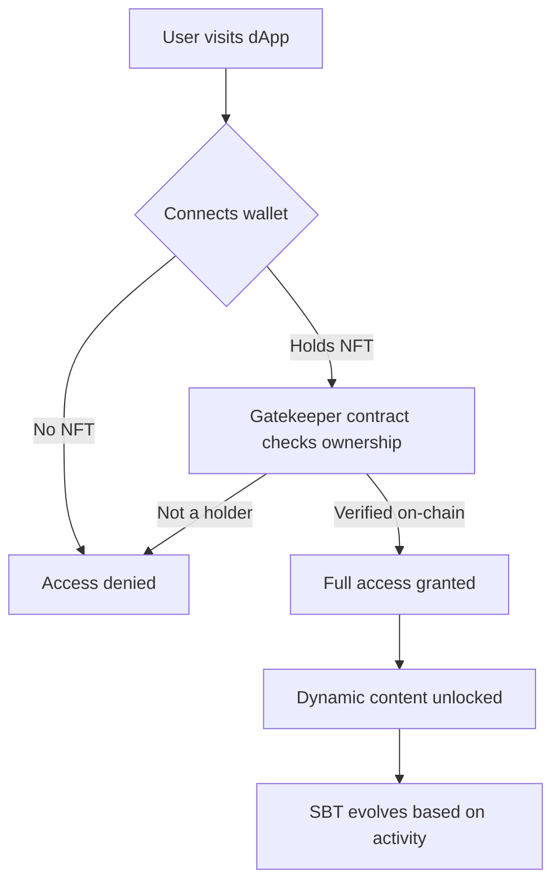

---

## About me

I'm a Full-Stack Web2 & Web3 Engineer. My focus is **NFT gating** — building systems where on-chain token ownership becomes a real key to real access. Whether that's a cinematic dashboard that only holders can enter, a car NFT that unlocks premium content, or a P2P marketplace with wallet-based identity — I build the full stack: smart contract, backend, and frontend.

On top of that I run AI automation workflows: n8n pipelines for real-time data delivery over Telegram, and a local LLM agent handling client support over WhatsApp.

---

## How NFT gating works — what I build

Every project I ship around NFT gating follows this pattern — the contract is the bouncer, the token is the ticket, and the metadata evolves based on what happens on-chain.

---

## Current flow

<table>
<tr>
<td valign="top" width="33%">

### ⛓️ Web3 & NFT Gating
- Custom Gatekeeper ownership checks
- Dynamic & Soulbound Token (SBT) logic
- Evolving metadata based on on-chain state
- P2P marketplace infrastructure
- On-chain lottery & prize distribution
- Smart contract security auditing

**Stack**

</td>
<td valign="top" width="33%">

### 🤖 Automation & AI
- n8n BTC price alerts via Telegram
- Qwen LLM client support via WhatsApp
- Webhook-driven pipelines
- Local LLM orchestration

**Stack**

</td>
<td valign="top" width="33%">

### 🏗️ Backend & Enterprise
- Java web applications
- PL/SQL employee & payroll systems
- REST APIs
- Database architecture

**Stack**

</td>
</tr>
</table>

---

## Frontend

---

## Pinned projects

| Project | Type | What it gates / does | Stack |
|---|---|---|---|
| [⚓ The Offshore Collective](https://github.com/MashiyaL/Dynamic-NFT) | NFT-Gated Dashboard | Hold the NFT → enter the cinematic dashboard. SBT metadata evolves with on-chain activity. | `TypeScript` `Solidity` `SBT` |
| [💸 SendiMali](https://github.com/MashiyaL/SendiMali) | P2P Marketplace | Wallet-based identity. Trustless peer-to-peer value exchange, no intermediary. | `Web3` `FinTech` |
| [🚗 Speed Gate](https://github.com/MashiyaL/speed-gate) | NFT Access Control | Mint a car NFT (Porsche, Ferrari, Lambo) via MetaMask → unlock gated premium content. | `Next.js` `Sepolia` |
| [🎰 Powerball](https://github.com/MashiyaL/Powerball) | On-chain Lottery | Protocol handles ticket logic, randomness, and prize distribution — no middleman. | `TypeScript` `Solidity` |
| [📡 Telegram BTC Bot](https://github.com/MashiyaL) | n8n Automation | Real-time BTC price alerts delivered to clients via Telegram. Fully automated. | `n8n` `Telegram` |
| [🤖 WhatsApp AI Agent](https://github.com/MashiyaL/whatsapp-bot) | AI Support Agent | Qwen LLM handles client queries over WhatsApp — no human in the loop. | `Node.js` `Qwen` |

---

## GitHub stats

---

## Contribution snake

<picture>
  <source media="(prefers-color-scheme: dark)" srcset="https://github.com/MashiyaL/MashiyaL/blob/output/github-contribution-grid-snake-dark.svg" />
  <source media="(prefers-color-scheme: light)" srcset="https://github.com/MashiyaL/MashiyaL/blob/output/github-contribution-grid-snake.svg" />
  
</picture>

---

