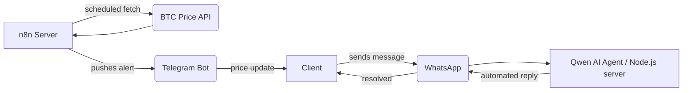

---

## About me

I'm a Full-Stack Web2 & Web3 Engineer with a particular interest in **backend servers and social messaging platforms**. I build the systems that sit behind the interface — APIs, automation pipelines, bot infrastructure, and smart contract backends — and I connect them to where people actually spend their time: WhatsApp, Telegram, and on-chain.

My Web3 work is an extension of that same interest: decentralised backends, NFT-gated access systems, and on-chain protocols that replace traditional server logic with trustless contracts.

---

## Current flow

<table>
<tr>
<td valign="top" width="33%">

### 🖥️ Backend & Servers
- REST API design & architecture
- Server-side automation pipelines
- n8n workflow orchestration
- Local LLM server deployment (Qwen)
- PL/SQL enterprise data systems
- Java web application backends

**Stack**

</td>
<td valign="top" width="33%">

### 💬 Social Messaging Platforms
- WhatsApp AI client support agent (Qwen)
- Telegram BTC price alert automation
- Bot infrastructure & webhook handlers
- Conversational AI flows
- Real-time data delivery to end users

**Stack**

</td>
<td valign="top" width="33%">

### ⛓️ Web3 & Smart Contracts
- NFT-gated dashboards & access control
- Dynamic & Soulbound Tokens (SBT)
- P2P marketplace infrastructure
- On-chain lottery & prize logic
- Smart contract security auditing

**Stack**

</td>
</tr>
</table>

---

## Frontend

---

## How the messaging stack connects

---

## Pinned projects

| Project | Type | What it does | Stack |
|---|---|---|---|
| [🤖 WhatsApp AI Agent](https://github.com/MashiyaL/whatsapp-bot) | Messaging Platform | Qwen LLM running on a local server, handling client support queries over WhatsApp — no human in the loop. | `Node.js` `Qwen` `AI` |
| [📡 Telegram BTC Bot](https://github.com/MashiyaL) | Messaging Automation | n8n server pipeline fetching real-time BTC prices and pushing alerts to clients via Telegram. | `n8n` `Telegram` |
| [⚓ The Offshore Collective](https://github.com/MashiyaL/Dynamic-NFT) | NFT-Gated Dashboard | On-chain Gatekeeper checks wallet ownership. Hold the NFT → enter the dashboard. SBT metadata evolves with activity. | `TypeScript` `Solidity` `SBT` |
| [💸 SendiMali](https://github.com/MashiyaL/SendiMali) | P2P Marketplace | Decentralised peer-to-peer value exchange — wallet-based identity, no intermediary. | `Web3` `FinTech` |
| [🚗 Speed Gate](https://github.com/MashiyaL/speed-gate) | NFT Access Control | Mint a car NFT (Porsche, Ferrari, Lambo) via MetaMask → server verifies on-chain ownership → content unlocked. | `Next.js` `Sepolia` |
| [🎰 Powerball](https://github.com/MashiyaL/Powerball) | On-chain Lottery | Smart contract backend handles ticket logic, randomness, and prize distribution — no centralised server needed. | `TypeScript` `Solidity` |

---

## GitHub stats

---

## Contribution snake

<picture>
  <source media="(prefers-color-scheme: dark)" srcset="https://github.com/MashiyaL/MashiyaL/blob/output/github-contribution-grid-snake-dark.svg" />
  <source media="(prefers-color-scheme: light)" srcset="https://github.com/MashiyaL/MashiyaL/blob/output/github-contribution-grid-snake.svg" />
  
</picture>

---

