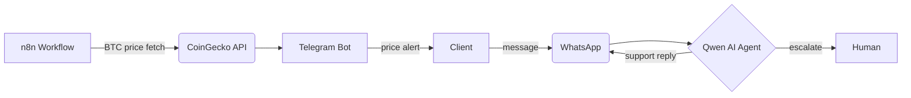

<div align="center">

```
   __                         _   __  __           _     _
  / /  _      ______ _____(_)  /  |/  /___ ______| |__ (_)_  ______ _
 / /  | | /| / / __ `/_  / | / / /|_/ / __ `/ ___/ '_ \| | |/_/ __ `/
/ /___| |/ |/ / /_/ / / /| |/ / /  / / /_/ (__  ) | | | |   </ /_/ /
\____/|__/|__/\__,_/ /___|___/_/  /_/\__,_/____/_| |_|_|_|\_\\__,_/
```

### Full-Stack Engineer · Web3 · AI Automation
*Building at the intersection of decentralised finance, social messaging, and AI — Johannesburg, ZA*

[](mailto:Lwazimashiya.lm@gmail.com)
[](https://www.linkedin.com/in/lwazi-mashiya-23a057255/)
[](https://x.com/LwaziMashiya)

</div>

---

## Current flow

<table>
<tr>
<td valign="top" width="33%">

### ⛓️ Web3
- NFT-gated dashboards
- Dynamic & Soulbound Tokens
- P2P marketplace (SendiMali)
- On-chain lottery (Powerball)
- Smart contract auditing

**Stack**


</td>
<td valign="top" width="33%">

### 🤖 Automation & AI
- n8n BTC price alerts via Telegram
- Qwen LLM client support via WhatsApp
- Webhook-driven workflows
- Local LLM orchestration

**Stack**


</td>
<td valign="top" width="33%">

### 🏗️ Backend & Enterprise
- PL/SQL employee systems
- Java web applications
- REST APIs
- Database design

**Stack**


</td>
</tr>
</table>

---

## Frontend


---

## How the automation stack connects



---

## Pinned projects

| Project | Type | Description | Stack |
|---|---|---|---|
| [⚓ The Offshore Collective](https://github.com/MashiyaL/Dynamic-NFT) | Dynamic NFT | Cinematic NFT-gated dashboard on Sepolia. Gatekeeper ownership check + evolving SBT metadata. | `TypeScript` `Solidity` `SBT` |
| [💸 SendiMali](https://github.com/MashiyaL/SendiMali) | P2P Marketplace | Decentralised peer-to-peer value exchange. Trustless, no intermediary. | `Web3` `FinTech` |
| [🚗 Speed Gate](https://github.com/MashiyaL/speed-gate) | NFT Access | Mint a car NFT (Porsche, Ferrari, Lambo) via MetaMask to unlock gated content. | `Next.js` `Sepolia` |
| [🎰 Powerball](https://github.com/MashiyaL/Powerball) | On-chain Lottery | Protocol handles ticket logic, randomness, and prize distribution on-chain. | `TypeScript` `Solidity` |
| [📡 Telegram BTC Bot](https://github.com/MashiyaL) | n8n Automation | Real-time BTC price alerts pushed to clients via Telegram. Fully automated. | `n8n` `Telegram` |
| [🤖 WhatsApp AI Agent](https://github.com/MashiyaL/whatsapp-bot) | AI Support | Qwen-powered agent handling client queries over WhatsApp, no human in the loop. | `Node.js` `Qwen` |

---

## GitHub stats

<div align="center">


</div>

---

## Contribution snake

<div align="center">


</div>

> *"If it can be automated, it should be. If it can be decentralised, it must be."*
